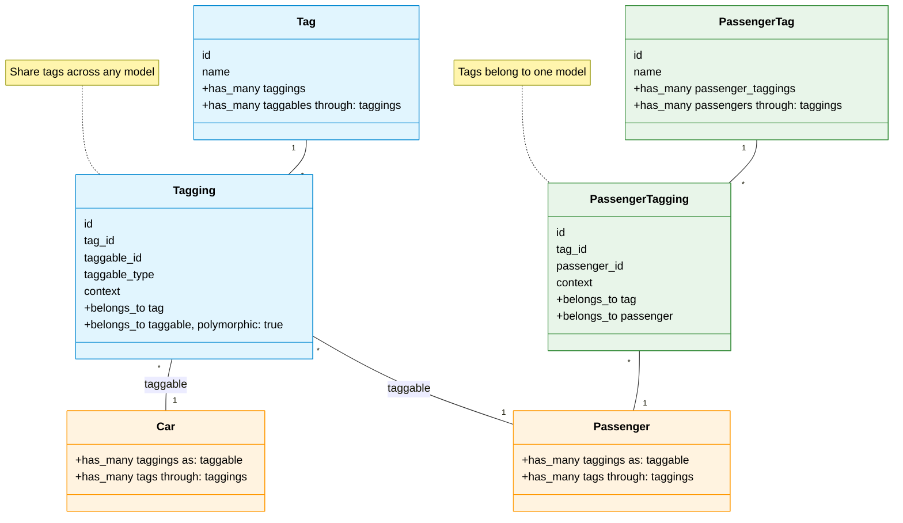

# Tagging Strategies

NoFlyList provides two strategic approaches to implementing tags in Rails applications: shared polymorphic tagging and model-specific tagging. 
This guide explains each strategy and helps you choose the right approach for your needs.

## Core Concepts

The fundamental difference between the two strategies lies in how they handle tag relationships:



## Shared Polymorphic Tagging

This strategy allows tags to be shared across different models through polymorphic associations. You can use any tag model name that makes sense for your domain.

### Implementation

```ruby
# The tag model - can have any name
class CategoryTag < ApplicationRecord
  include NoFlyList::ApplicationTag
end

class Article < ApplicationRecord
  include NoFlyList::TaggableRecord

  has_tags :categories,
    polymorphic: true,
    tag_class_name: 'CategoryTag'
end

class Video < ApplicationRecord
  include NoFlyList::TaggableRecord

  has_tags :categories,
    polymorphic: true,
    tag_class_name: 'CategoryTag'
end
```

### Database Structure

The tag and tagging tables can have any name that fits your domain:

```sql
CREATE TABLE category_tags (
  id bigint NOT NULL,
  name string NOT NULL,
  created_at datetime NOT NULL,
  updated_at datetime NOT NULL
);

CREATE TABLE category_taggings (
  id bigint NOT NULL,
  tag_id bigint NOT NULL,
  taggable_type string NOT NULL,
  taggable_id bigint NOT NULL,
  context string NOT NULL,
  created_at datetime NOT NULL,
  updated_at datetime NOT NULL
);
```

### Key Benefits

1. Shared Taxonomy: Maintain consistent categorization across different models
2. Cross-Model Operations: Query tagged content across your entire domain
3. Centralized Management: Manage related tags in one place
4. Storage Efficiency: Store each unique tag only once

### When to Use

Choose shared polymorphic tagging when your tags:
- Need to be consistent across multiple models
- Represent concepts that span different types of records
- Would benefit from cross-model searching or filtering
- Form part of a shared vocabulary in your domain

## Model-Specific Tagging

This strategy creates dedicated tag tables for each model, keeping tags isolated within their specific context.

### Implementation

```ruby
class Passenger < ApplicationRecord
  include NoFlyList::TaggableRecord

  has_tags :special_needs,
    restrict_to_existing: false,
    counter_cache: true
end
```

### Database Structure

```sql
CREATE TABLE passenger_tags (
  id bigint NOT NULL,
  name string NOT NULL,
  created_at datetime NOT NULL,
  updated_at datetime NOT NULL
);

CREATE TABLE passenger_taggings (
  id bigint NOT NULL,
  tag_id bigint NOT NULL,
  passenger_id bigint NOT NULL,
  context string NOT NULL,
  created_at datetime NOT NULL,
  updated_at datetime NOT NULL
);
```

### Key Benefits

1. Data Isolation: Keep tags within their specific context
2. Simplified Queries: More straightforward and efficient database operations
3. Domain-Specific Rules: Implement validation specific to each model
4. Clear Boundaries: Maintain separation between different types of tags

### When to Use

Choose model-specific tagging when your tags:
- Only make sense within one model's context
- Need model-specific validation rules
- Represent attributes unique to a specific type of record
- Should be isolated from other models' tags

## Combining Both Approaches

You can use both strategies in the same application to get the best of both worlds:

```ruby
class Passenger < ApplicationRecord
  include NoFlyList::TaggableRecord

  # Model-specific tags for passenger attributes
  has_tags :special_needs
  has_tags :dietary_restrictions

  # Shared tags for cross-model concepts
  has_tags :status,
    polymorphic: true,
    tag_class_name: 'StatusTag'
end
```

## Performance Considerations

### Query Complexity
- Shared tags require additional JOINs for polymorphic queries
- Model-specific tags have simpler, more direct queries

### Indexing Strategy
- Shared tags: Index on (taggable_type, taggable_id, context)
- Model-specific tags: Simple indexes on foreign keys

### Cache Efficiency
- Shared tags: Cached queries can benefit multiple models
- Model-specific tags: More focused cache utilization

## Summary

Choose the tagging strategy that aligns with your domain needs:

- Use shared polymorphic tagging for concepts that span multiple models
- Use model-specific tagging for attributes that belong to a single model
- Combine both approaches when you need both shared and isolated tags
